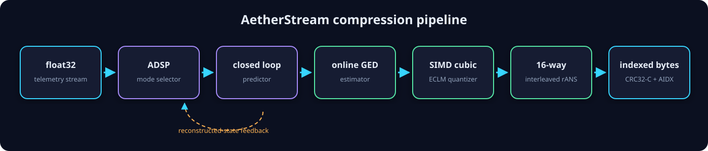
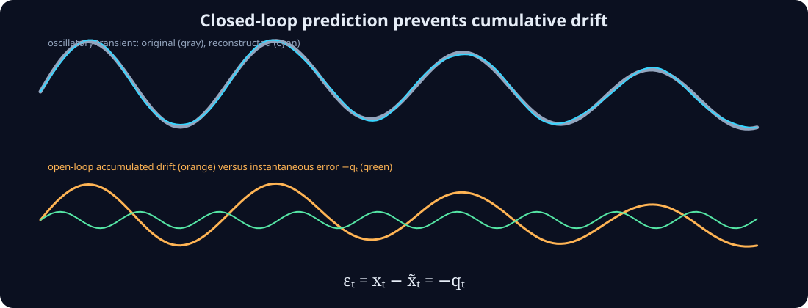
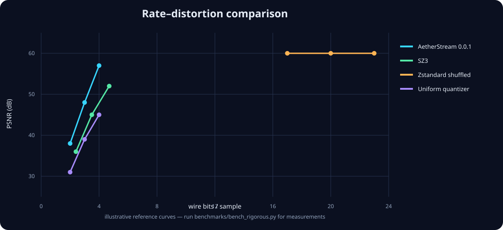

# AetherStream

AetherStream compresses one-dimensional `float32` sensor data from C++20 or Python. It supports sequential streaming, indexed slices, fixed wire-rate targets, and pointwise absolute-error limits.

**Version 0.0.1**

[](https://pypi.org/project/aetherstream/)
[](https://github.com/animish-sharma/aetherstream/actions/workflows/ci.yml)
[](https://github.com/animish-sharma/aetherstream/actions/workflows/wheels.yml)
[](LICENSE)
[](https://en.cppreference.com/w/cpp/20)
[](https://pypi.org/project/aetherstream/)

[Quickstart](#quickstart) · [Installation](#installation) · [Features](#key-features) · [Benchmarks](#benchmarks) · [C++ API](#c-api) · [Troubleshooting](#troubleshooting)



## Overview

AetherStream is intended for finite telemetry such as seismic, strain-gauge, machinery, and industrial sensor traces. Inputs must be one-dimensional and contain only finite values.

The encoder processes 2,048-sample blocks. It predicts each next value from reconstructed history, quantizes the prediction residual, and entropy-codes the resulting symbols with interleaved range asymmetric numeral systems (rANS). The decoder reverses these steps. You can choose one of two modes:

- `target_rate` limits the serialized bits per input sample. Very short inputs can be too small to fit the fixed framing overhead and raise `RateBudgetError`.
- `absolute_error` limits the pointwise reconstruction error, subject to documented `float32` rounding tolerance.

`StreamEncoder` accepts input in smaller batches. An optional block index supports slices without decoding the entire frame.

Performance depends on the processor, compiler, and input data. Run the included benchmarks on the deployment system before making performance claims.

### Included in 0.0.1

- **72.26× measured cached random-access speedup** for a 512-sample window in the local 144,000-sample EarthScope trace: 23.815 µs cached indexed slicing versus 1,720.753 µs full decompression (32.966 µs through the one-shot API).
- **Wire format v6** with a CRC-protected AIDX footer, cached C++/Python indexed views, and an explicit migration policy that retains unindexed-v5 decoding while rejecting ambiguous indexed-v5 footers.
- **Six-segment hybrid Chebyshev ECLM evaluation** with exact dead-zone/tail handling, local boundary correction, AVX2 FMA, and ARM64 Neon kernels.
- **Native Arrow bridge** with zero-copy primitive-buffer input views and direct-to-Arrow decoding.
- **In-tree MiniSEED-2 decoder** for live EarthScope INT16/INT32/float, Steim-1, and Steim-2 records—no ObsPy dependency.

> Benchmark timings are local-machine measurements, not universal performance guarantees. See [Benchmarks](#benchmarks) for provenance and complete reproduction commands.

## Key features

- **Dual modes**
  - Rate-targeted: empirical re-encoding accounts for metadata, codebooks, entropy tables, CRC, and alignment. An infeasible short stream raises `RateBudgetError` instead of exceeding its budget.
  - Error-bounded: enforces `|x[t] - reconstructed[t]| ≤ tolerance` up to documented float32 rounding tolerance; zero runs and non-zero quanta are rANS-coded.
- **ADSP prediction:** selects constant, harmonic, or linear prediction for each 2048-sample block.
- **Closed-loop state:** encoder and decoder predict from reconstructed history, preventing integrated predictor drift.
- **Indexed random access:** optional CRC-protected AIDX block tables let `IndexedStreamView` validate once, seek in O(log N-blocks), and decode only intersecting blocks without copying the compressed stream; `decompress_slice()` remains the one-shot convenience API.
- **Runtime SIMD dispatch:** scalar, x86 AVX2/FMA, x86 AVX-512, and ARM64 Neon implementations, including a six-segment hybrid Chebyshev quantizer evaluator and enforced quality-gate benchmark.
- **Impulsive-tail preservation:** rate mode reserves 80% of sufficiently large low-beta codebooks for the central region and 20% for logarithmically spaced tails when observed residual peaks exceed `8σ`.
- **Arrow interoperability:** optional PyArrow input views are compressed without copying primitive values, and decoding writes directly into Arrow-owned buffers.
- **Dependency-free MiniSEED reader:** benchmark acquisition decodes EarthScope Steim-1/Steim-2 data without ObsPy.
- **Incremental framing:** `StreamEncoder` and `StreamDecoder` handle sample micro-batches and arbitrary byte fragmentation.
- **Defensive decoding:** little-endian wire format, 64-byte block alignment, CRC32-C, bounded allocation, sparse frequency-table validation, and final rANS-state checks.
- **Operational tooling:** ASan/UBSan, libFuzzer, malformed corpus, 16-thread stress tests, CMake exports, PyPI wheels, Conda/vcpkg recipes, and a reproducible container.



## Quickstart

### Python

```bash
python -m pip install --upgrade aetherstream
```

```python
import numpy as np
import aetherstream as aether

samples = np.sin(np.linspace(0, 100, 100_000, dtype=np.float32))

# Exact serialized-rate mode. May reject very short infeasible inputs.
compressed = aether.compress(samples, target_rate=3.0)
reconstructed = aether.decompress(compressed, length=len(samples))

# Pointwise absolute-error mode.
bounded = aether.compress(samples, absolute_error=0.005)
bounded_reconstruction = aether.decompress(bounded, length=len(samples))
assert np.max(np.abs(samples - bounded_reconstruction)) <= 0.005001

# Optional block index for compressed-domain slicing.
indexed = aether.compress(samples, target_rate=3.0, enable_index=True)
window = aether.decompress_slice(indexed, start=40_000, count=512)
```

### Apache Arrow

```bash
python -m pip install "aetherstream[arrow]"
```

```python
import pyarrow as pa
from aetherstream.arrow import compress_arrow_array, decompress_arrow_buffer

arrow_values = pa.chunked_array(
    [pa.array(samples[:50_000]), pa.array(samples[50_000:])],
    type=pa.float32(),
)
arrow_wire = compress_arrow_array(arrow_values, target_rate=3.0)
arrow_restored = decompress_arrow_buffer(arrow_wire, length=len(samples))
```

Input chunks must be null-free Arrow `float32` arrays. Preserve a separate validity bitmap when null semantics are required.

### Real-time packet streaming

```python
encoder = aether.StreamEncoder(target_rate=3.0)
decoder = aether.StreamDecoder()

for packet in sensor_packets:       # one-dimensional float32-compatible arrays
    wire = encoder.feed(packet)
    if wire:
        restored = decoder.feed(wire)

final_wire = encoder.flush()
if final_wire:
    final_samples = decoder.feed(final_wire)
decoder.flush()                     # rejects an incomplete final byte frame
```

## Installation

Complete commands and platform caveats are in the **[installation matrix](docs/INSTALLATION.md)**.

### PyPI wheels

```bash
python -m pip install aetherstream
# Include optional Apache Arrow integration:
python -m pip install "aetherstream[arrow]"
```

The wheel matrix targets CPython 3.9–3.13, manylinux 2.28 x86-64/aarch64, macOS x86-64/arm64, and Windows AMD64.

### Low-memory source build

```bash
git clone https://github.com/animish-sharma/aetherstream.git
cd aetherstream
python3 -m venv .venv && source .venv/bin/activate
python -m pip install --upgrade pip
python -m pip install scikit-build-core pybind11 numpy
AETHER_LOW_MEMORY=1 CMAKE_BUILD_PARALLEL_LEVEL=1 \
  python -m pip install -e . --no-build-isolation
```

The low-memory profile uses `-O1 -g0`, disables LTO/native code generation, and limits compilation to one job. For a local host-specific build:

```bash
AETHER_NATIVE_OPTIMIZED=1 CMAKE_BUILD_PARALLEL_LEVEL=4 python -m pip install -e .
```

Never distribute a host-native wheel.

### Conda

```bash
conda install -c conda-forge aetherstream
```

Until the feedstock is accepted, build the included recipe with `conda build conda-recipe`.

### CMake FetchContent

```cmake
include(FetchContent)
FetchContent_Declare(aetherstream
  GIT_REPOSITORY https://github.com/animish-sharma/aetherstream.git
  GIT_TAG v0.0.1)
set(AETHER_BUILD_PYTHON OFF CACHE BOOL "" FORCE)
FetchContent_MakeAvailable(aetherstream)
target_link_libraries(your_application PRIVATE aether::aether_core)
```

### System CMake install

```bash
cmake -S . -B build -DAETHER_BUILD_PYTHON=OFF -DAETHER_BUILD_TESTS=OFF
cmake --build build --parallel 1
sudo cmake --install build
```

Consumers can then use `find_package(AetherStream 0.0.1 REQUIRED CONFIG)` and `aether::aether_core`.

### vcpkg and Docker

```bash
vcpkg install aetherstream --overlay-ports=ports
docker build -t aetherstream:0.0.1 .
docker run --rm aetherstream:0.0.1
```

## C++ API

```cpp
#include <aether/aether.hpp>
#include <aether/table.hpp>

#include <cmath>
#include <cstdint>
#include <iostream>
#include <numbers>
#include <vector>

int main() {
    std::vector<float> telemetry(10'000);
    for (std::size_t i = 0; i < telemetry.size(); ++i) {
        telemetry[i] = std::sin(2.0f * std::numbers::pi_v<float> *
                                static_cast<float>(i) / 100.0f);
    }

    aether::CodecConfig config;
    config.target_rate = 3.0f;
    config.absolute_error_bound = 0.0f;
    config.deadzone_factor = 0.3f;
    config.enable_index = true;

    const aether::AetherCodec codec(config);
    const std::vector<uint8_t> wire = codec.compress(telemetry);

    std::vector<float> restored(telemetry.size());
    codec.decompress(wire, restored);
    std::vector<float> window(512);
    aether::decompress_slice(wire, 4096, window.size(), window);
    std::cout << telemetry.size() * sizeof(float) << " input bytes -> "
              << wire.size() << " wire bytes\n";
}
```

See the **[API reference](docs/API_REFERENCE.md)** for exceptions, ownership, and streaming semantics.

## Mathematical foundation

### Closed-loop stability

Let `e[t] = x[t] - prediction[t]`, and define quantization error `q[t] = reconstructed_residual[t] - e[t]`. Because both sides update predictor state from the same reconstructed history,

```math
x[t] - \widetilde{x}[t] = e[t] - \widetilde{e}[t] = -q[t].
```

The reconstruction error is instantaneous rather than recursively integrated.

### GED moment inversion

The block shape parameter is recovered from

```math
R(\beta)=\frac{m_1^2}{m_2}
=\frac{\Gamma(2/\beta)^2}{\Gamma(1/\beta)\Gamma(3/\beta)}.
```

### Entropy-constrained boundaries

```math
b_i=\frac{y_i+y_{i+1}}{2}
+\frac{\lambda}{2(y_{i+1}-y_i)}\log_2\!\left(\frac{p_i}{p_{i+1}}\right).
```

The analytical entropy target initializes the codebook; serialized-byte measurements close the rate-control loop.

## Benchmarks



The AetherStream series in this checked-in SVG was generated from the live EarthScope run below and averaged by requested rate across the two datasets. Comparison reference curves remain illustrative and must not be interpreted as measured competitor results.

```bash
python benchmarks/fetch_usgs_data.py --strict
python benchmarks/bench_rigorous.py
python benchmarks/bench_random_access.py
```

The fetcher uses `urllib.request` and an in-tree MiniSEED-2/Steim decoder; ObsPy is not required. The verified strict run downloaded 144,000 samples from `IU.ANMO.00.BHZ`, 86,343 samples from `PB.B004.T0.LS1`, and 18,001 strong-motion samples from `CI.CCC..HNE` during the 2019 Ridgecrest Mw 7.1 mainshock. SCEDC StationXML sensitivity (`213979.6422 counts/(m/s²)`) verifies a measured peak of **0.5607 g** for the Ridgecrest trace.

### Measured AetherStream results

| Dataset | Mode | Wire bits/sample | Ratio | PSNR | Encode GB/s | Decode GB/s |
|---|---|---:|---:|---:|---:|---:|
| CI.CCC Ridgecrest HNE | Rate 2 | 1.707 | 18.75× | 38.36 dB | 0.006 | 0.435 |
| CI.CCC Ridgecrest HNE | Rate 3 | 2.702 | 11.84× | 42.58 dB | 0.003 | 0.358 |
| CI.CCC Ridgecrest HNE | Rate 4 | 3.555 | 9.00× | 45.85 dB | 0.003 | 0.321 |
| IU.ANMO seismic | Rate 2 | 1.764 | 18.15× | 24.93 dB | 0.007 | 0.418 |
| IU.ANMO seismic | Rate 3 | 2.734 | 11.70× | 43.77 dB | 0.003 | 0.361 |
| IU.ANMO seismic | Rate 4 | 3.705 | 8.64× | 49.04 dB | 0.002 | 0.325 |
| PB.B004 strain | Rate 2 | 1.352 | 23.67× | 15.59 dB | 0.011 | 0.491 |
| PB.B004 strain | Rate 3 | 1.838 | 17.41× | 16.39 dB | 0.004 | 0.451 |
| PB.B004 strain | Rate 4 | 2.283 | 14.02× | 17.73 dB | 0.002 | 0.411 |

Strict error-mode runs met their `0.01` and `0.001` pointwise bounds on all traces. Ridgecrest analysis naturally triggered the tail criterion in block 7 (`beta=0.4299`, peak `9.94σ`); the adaptive partition improved that field block by **0.22 dB at rate 3** and **2.16 dB at rate 6**. Rate 4 selected the ordinary codebook through the distortion guard, avoiding a regression.

### Indexed slicing

| Samples in frame | Requested window | Full decode | Cached indexed slice | Speedup |
|---:|---:|---:|---:|---:|
| 144,000 | 512 | 1,720.753 µs | 23.815 µs | **72.26×** |

On the local x86-64 validation host, `bench_simd_quantizer.py` measured 133.63 Msamples/s for AVX2 versus 94.07 Msamples/s scalar (**1.42×**). Native/exact symbol disagreement was **0.0001%**, and polynomial PSNR impact was below `0.000001 dB`; the synthetic impulsive-tail case gained 0.81 dB over its ordinary GED codebook. These are host-specific measurements, not portable guarantees.

The rigorous suite records data provenance and compares AetherStream with Zstandard raw/shuffled modes, uniform Lloyd–Max, and the official SZ3 executable when installed. SZ3 is omitted when its official executable is unavailable; no simulated row is reported. It writes:

- `benchmarks/results/benchmark_results.csv`
- `benchmarks/results/benchmark_results.json`
- `benchmarks/results/pareto_frontier.png`
- `benchmarks/results/random_access.json`
- `benchmarks/results/simd_quantizer.json`
- `benchmarks/results/ridgecrest_tail_validation.json`

Report CPU, compiler, SIMD backend, source trace, sample count, and command line with results. Synthetic fallback traces are marked as synthetic in `benchmarks/data/manifest.json`.

## Testing and security

```bash
python -m pytest -v
cmake -S . -B build -DAETHER_BUILD_TESTS=ON -DAETHER_BUILD_PYTHON=OFF
cmake --build build --parallel 1
ctest --test-dir build --output-on-failure
```

The local 0.0.1 candidate passed 15 Python tests, 7 native tests, and the same 7 tests under ASan/UBSan. Formatting, linting, type checking, strict documentation, Docker, external-consumer, packaging, and a 269,060-execution fuzz run also passed.

Sanitizer and fuzzing procedures are documented in [CONTRIBUTING.md](CONTRIBUTING.md). Report vulnerabilities privately according to [SECURITY.md](SECURITY.md). The normative interoperability contract is [Wire Format v6](docs/WIRE_FORMAT_SPEC.md), and maintainers should follow the [release checklist](docs/RELEASE_CHECKLIST.md).

## Troubleshooting

<details>
<summary><strong>The compiler was killed or ran out of memory</strong></summary>

Use `AETHER_LOW_MEMORY=1 CMAKE_BUILD_PARALLEL_LEVEL=1`. If necessary, add `CXXFLAGS=-O0`. Avoid build isolation on a constrained host after installing build dependencies.
</details>

<details>
<summary><strong>RateBudgetError on a short input</strong></summary>

A non-empty stream has fixed framing and integrity bytes. No codec can serialize below that minimum. Buffer more samples, use `StreamEncoder`, raise the rate, or select absolute-error mode.
</details>

<details>
<summary><strong>NaN or infinity is rejected</strong></summary>

Non-finite values violate predictor and GED assumptions. Preserve a separate validity mask and impute finite values before compression.
</details>

<details>
<summary><strong>Unexpected SIMD behavior in a VM</strong></summary>

Set `AETHER_SIMD=scalar` and rerun parity tests. Verify that the hypervisor exposes OSXSAVE and the advertised instruction set consistently.
</details>

## Governance, license, and citation

Contributions follow [CONTRIBUTING.md](CONTRIBUTING.md) and the [Code of Conduct](CODE_OF_CONDUCT.md). AetherStream is distributed under the [MIT License](LICENSE).

```bibtex
@software{sharma2026aetherstream,
  author  = {Animish Sharma and AetherStream contributors},
  title   = {AetherStream: Streaming Telemetry Compression},
  year    = {2026},
  version = {0.0.1},
  url     = {https://github.com/animish-sharma/aetherstream}
}
```
